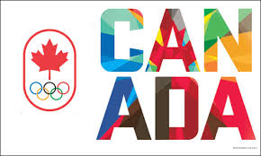

# DataViz - Olympic Data Outline

This website is designed to deliver the graphic data of medals achived by the country "Canada".It shows the comparision of men and women by three different types of visualization. It shows the easiest representation of achievements by Canada. The bar graphs, line charts and pie charts are used for representation of data .

### Getting started 
This is a basic HTML / CSS build. Download this git file and then extract the files in folder of your choice to see the data visualizations. 

### Prerequitsites
Adobe photoshop , google drive and Git.

## Author
Jaskaran Singh

## copyright

